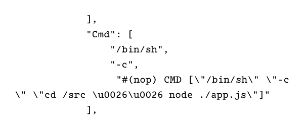

# Running Containers

Images are *build-time* constructs, whereas containers are *run-time* constructs.

We use `docker container run` and `docker service create` commands to start one or more containers from a single image.

You cannot delete the image until the last container using it has been stopped and destroyed.

Images don't contain a kernel. All containers running on a Docker host share access to the host's kernel.

Containers run until the app they are executing exits. For example, a Linux container exits when the Bash shell exits.

Pull an image:

```docker image pull ubuntu:latest```

View images:

```docker image ls```

Run container from image in interactive mode:

```docker container run -it ubuntu:latest /bin/bash```

Press `Ctrl-PQ` to exit the container without terminating it.

It should still be visible through this command:

```docker container ls```

You can attach your shell to the terminal of a running container with the `docker container exec` command:

```docker container exec -it inspiring_banzai bash```

This `exec` command runs a *new* process inside a running container. This means the container won't stop when you exit it.

To stop the container:

```docker container stop inspiring_banzai```

To restart the container:

```docker container start inspiring_banzai```

To remove the container:

```docker container rm inspiring_banzai```

To check the container is removed, run:

```docker container ls -a```

The `-a` flag tells Docker to list *all* containers, even those in stopped state.

To delete a running container with a single command:

```docker container rm percy -f```

But it's best practice to take the two-step approach of stopping then removing the container.

## Self-Healing Containers with Restart Policies

Restart policies can be configured:

- imperatively on the command line as part of run commands
- declaratively in YAML files for use with Docker Swarm, Docker Compose, and Kubernetes

There are currently three types of restart policy:

- always
- unless-stopped
- on-failed

### always

This policy always restarts a stopped container unless it has been explicitly stopped, such as via a `docker container stop` command.

For example, if you exit from a container's shell, it kills the container. However, if you've set the `--restart always` policy, it'll restart automatically.

If you explicitly stop a container with `docker container stop` and restart the Docker daemon, the container will be automatically restarted.

### unless-stopped

Unlike containers with the `--restart always` policy, those with an `unless-stopped` policy won't be restarted when the daemon restarts.

### on-failure

The `on-failure` policy restarts a containers if it exits with a non-zero exit code. It also restarts containers when the Docker daemon restarts, even containers that were in the stopped state.

## Inspecting Containers

```docker image inspect <image-name>```

The command above allows you to see what the container is designed to run, unless you override it with different instructions. Sometimes the default app is listed as `ENTRYPOINT` instead of `CMD`.



