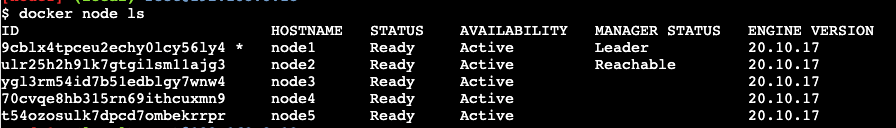
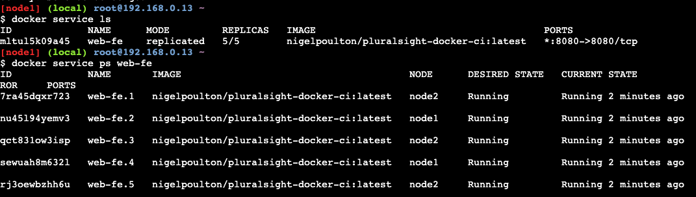
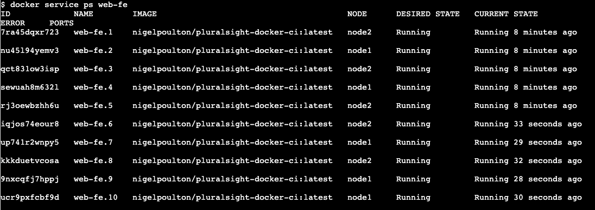

# Docker Swarm

Docker Swarm is:

- An enterprise-grade secure cluster of Docker hosts.
- An engine for orchestrating microservices apps.

Swarm groups one or more Docker nodes and lets you manage them as a cluster. You get:

- an encrypted distributed cluster store
- encrypted networks
- mutual TLS
- secure cluster join tokens
- PKI (public key infrastructure) for managing and rotating certificates

As an orchestrator, Swarm exposes a rich API to allows you to deploy and manage complex microservices apps. You define your apps in declarative manifest files and deploy them to the Swarm with Docker command. You can also perform:

- rolling updates
- rollbacks
- scaling

Docker Swarm competes directly with Kubernetes, but it's much simpler to configure and deploy.

## Swarm Basics

- A swarm consists of one or more Docker *nodes* - they can be physical servers, VMs, or cloud instances.
- Nodes are configured as *managers* or *workers*.
- *Managers* look after the control plane.
- *Workers* accept tasks from managers and execute them.
- The configuration and state of the swarm is stored in a distributed *etcd* database, held on all managers.
- Swarm uses TLS to encrypt communications, authenticate nodes, and authorize roles. Automatic key rotation is also included.

On a Swarm, the atomic unit of scheduling is the *service*. This wraps some advanced features around containers, including:

- scaling
- rolling updates
- simple rollbacks

A service is effectively an enhanced container.

## Creating a Swarm

`docker swarm init --advertise-addr 10.0.0.1:2377`

To join a node to a Swarm, use:

```
docker swarm join-token manager

docker swarm join-token worker
```

You can then copy and paste the relevant generated token into your additional nodes.

To list the nodes in the Swarm, use:

`docker node ls`



The asterisk denotes which node you are logged into and executing commands from.

## Maintaining High Availability (HA)

Swarm managers include native support for high availability (HA). This means one or more nodes can fail, and the survivors keep the swarm running.

Although you have multiple *managers*, only one of them is *active* at any time. This active manager is called the *leader*. Only the leader issues live commands to the Swarm. This is called *active-passive multi-manager HA*.

Managers are either *leaders* or *followers*. This is Raft terminology. Its uses an implementation of the Raft consensus algorithm to maintain a consistent cluster state across multiple highly available managers.

Two best practices apply:

1. Deploy an *odd* number of managers.
2. Don't deploy too many managers (3 or 5 is recommended) - decision-making is faster!

An odd number of managers helps ensure *quorum* and avoid split-brain conditions. A swarm cluster continues to operate during split-brain conditions, but you are no longer able to alter the configuration or add and manage application workloads.

## Locking a Swarm

Restarting an older manager or restoring an old backup has the potential to compromise the cluster.

Docker allows you to lock a swarm with the *Autolock* feature. This forces restarted managers to present the cluster unlock key before they're readmitted to the cluster.

To apply an autolock when creating a swarm:

```
docker swarm init --autolock
```

To autolock an existing swarm:

```
docker swarm update --autolock=true
```

You'll then see a key. Keep this in a safe place! Without it, the manager is unable to rejoin the swarm.

You can check your current swarm unlock key with:

```
docker swarm unlock-key
```

To unlock, use:

```
docker swarm unlock
```

Locking your swarm and protecting the unlock key is recommended for production environments.

## Swarm Services

Services allow us to specify most of the familiar container options, such as name, port mappings, images, etc. But they also add important cloud-native features, such  as *desired state* and automatic reconciliation.

There are two methods for creating services:

- Imperatively on the command line with `docker service create`.
- Declaratively with a stack file

```
docker service create --name web-fe -p 8080:8080 --replicas 5 nigelpoulton/pluralsight-docker-ci

```

To see all the services running on a swarm:

```
docker service ls
```

This output also shows you the number of replicas.

To see all the service replicas and their respective state:

```
docker service ps <service-name>
```



For detailed information about a service, use:

`docker service inspect <service-name>`

Add the `--pretty' flag to limit the output to the most important information.

## Replicated vs Global Services

The default replication mode of a service is `replicated`. This deploys a desired number of replicas and distributes them as evenly as possible across the cluster.

The other mode is `global`, which runs a single replica on every node in the swarm:

`docker service create ... --mode global`

## Scaling a Service

`docker service scale web-fe=10`

Running `docker service ps` should show the replicas have been created and are distributed evenly.



## Removing a Service

`docker service rm <service-name>`

Be careful, as you won't be asked to confirm your action1

## Rolling Updates

Create a new service and attach it to a network:

```
docker service create --name uber-svc --network uber-net -p 80:80 --replicas 12 nigelpoulton/tu-demo:v1
```

This mode of publishing a port on every node in the swarm - even nodes not running service replicas - is called *ingress mode* and is the default. The alternative mode is *host mode*, which only publishes the service on swarm nodes running replicas.

```
docker service create --name uber-svc --network uber-net --publish published=80,target=80,mode=host --replicas 12 nigelpoulton/tu-demo:v1
```

With *ingress mode*, every mode gets a mapping and can therefore redirect your request to a node that's running the service.

Use the following command to run a staged or rolling update:

```
docker service update --image nigelpoulton/tu-demo:v2 --update-parallelism 2 --update-delay 20s uber-svc
```

`--update-parallelism 2` - pushes new image to 2 replicas at a time.

`--update-delay 20s` - adds a 20s cool-off period between each set of two.

Use the `docker service inspect --pretty <service-name>` to get an overview.

Future updates will automatically use these settings, unless you override them as part of the `docker service update` command.

## Troubleshooting

To view the swarm service logs:

`docker service logs <service-name>`

By default, Docker nodes configure services to use the `json-file` log driver. Other log drivers include:

- journald
- syslog
- splunk
- gelf

This snippet shows a Docker host configured to use `syslog`:

```
{
    "log-driver": "syslog"
}
```

You can force individual services to use a different driver by passing the `--log-driver` and `--log-opts` flags to the `docker service create` command.

You can:

- Follow the logs `--follow`
- Tail the logs `--tail`
- Get extra details `--details`

## Backing Up a Swarm

Backing up a swarm backs up the control plane objects required to recover the swarm in the event of failure or corruption.

Swarm configuration and state is stored in `var/lib/docker/swarm` on every manager node. A swarm backup is a copy of all the files in this directory.

You need to stop the Docker daemon on the node you are backing up, so it's a good idea to perform the backup from non-leader managers.

Backup process:

1. Stop Docker on a non-leader swarm manager (`service docker stop`)
2. Back up the Swarm config
3. Verify the backup file exists
4. Restart Docker (`service docker restart`)

## Restoring a Backup

- You can only restore to a node running the same version of Docker the backup was performed on.
- You can only restore to a node with the same IP address as the node the backup was performed on.

1. Restore the Swarm configuration from backup.
2. Start Docker (`docker service start`)
3. Initialize a new Swarm cluster. The `--force-new-cluster` flag tells Docker to create a new cluster using the configuration stored in `/var/lib/docker/swarm/` that you recovered in step 1.
4. Add new manager and worker nodes.