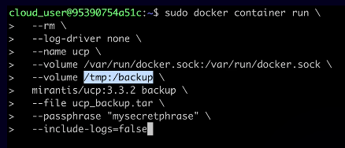

# Backing Up UCP and DTR

1. Back up the Docker Swarm
2. Back up UCP
3. Back up DTR Images
4. Back up DTR Metadata

## Back Up UCP

This is done with an image:

## Back Up DTR Images

`/var/lib/docker/volumes/dtr-registry`

## Back Up DTR Metadata

This is done with an image.
